# [Recipeze](https://recipeze-da8be575c94f.herokuapp.com)

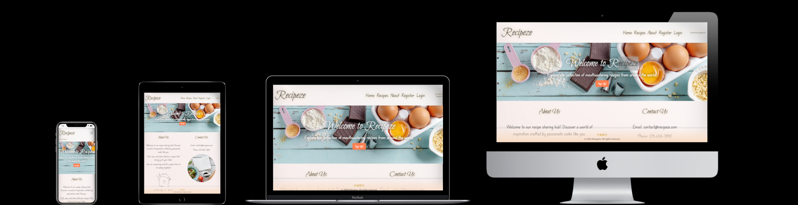

[Deployed website](https://recipeze-da8be575c94f.herokuapp.com)

[Am i Responsive](https://ui.dev/amiresponsive?url=https://recipeze-da8be575c94f.herokuapp.com)

## **Table of Contents**
1. [Introduction](#introduction)
2. [Features](#features)
3. [Planning](#planning)
4. [Wireframes](#wireframes)
5. [Testing](#testing)
6. [Deployment](#deployment)
7. [Credits](#credits)

## **Introduction**

Welcome to Recipeze, your go-to destination for discovering and sharing delicious recipes. Whether you're a seasoned chef or a beginner in the kitchen, Recipeze is here to inspire your cooking adventures.

Our platform is brimming with inspiration to transform your kitchen into a playground of flavors. Join our vibrant community of food enthusiasts and embark on a cooking odyssey filled with endless possibilities.

Don't forget to leave comments and reviews on your favorite recipes, sharing your thoughts and insights to help others discover their next culinary masterpiece.

### Technologies Used
Here's a breakdown of the technologies that was used in Recipeze:

- Languages:
  - HTML5: Provides the core structure and content of the web application.
  - CSS3: Adds style and visual flair to the user interface.
  - JavaScript: Enhances interactivity and user experience with dynamic features.
  - Python: Serves as the backend language, powering the application's logic and functionality.

- Frameworks:
  - Bootstrap 5: Utilizes a popular CSS framework for rapid and responsive web development.
  - Django: Leverages a powerful Python web framework to streamline development and enhance security.
  - Databases & Deployment:

- Database:
  - ElephantSQL
  - Cloudinary: media management by automatically delivering optimized images, enhancing user experience.

## **Features**
- **User Authentication:** Sign up, log in, and manage your profile.
- **Recipe Management:** Create, edit, delete, and save your favorite recipes.
- **Recipe List:** Organize recipes into a 3 x 3 grid for easy browsing.
- **Responsive Design:** Access Recipeze from any device, ensuring a seamless experience on desktops, tablets, and mobile phones.

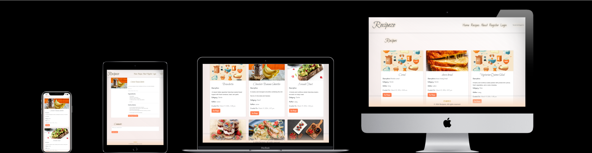
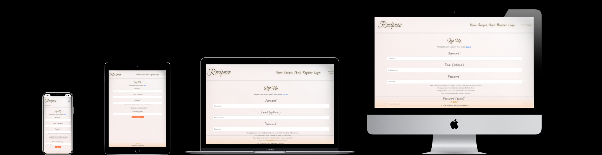
### **Features Left to Implement**

- Profile Page
- Saved Recipes 
- Ratings

## **Planning and Design**

The Recipeze project began with a thorough planning process to ensure a well-structured application. Here's a breakdown of some of the steps involved:

- **User Story Creation:** User stories were crafted to capture the functionalities desired by both logged-in users (those who have created an account) and logged-out users (visitors browsing the app). This approach ensures the application caters to the needs of various user groups.
- **Wireframing with Balsamiq:** To visualize the application's layout and user interface (UI) elements, wireframes were created using Balsamiq. These wireframes are low-fidelity mockups that focus on the overall structure and user flow rather than aesthetics. 
- **Database Schema Design:**  Lucidchart was used to design the Recipeze application's database schema. A database schema essentially defines how data will be organized within the application. Lucidchart provides a visual interface to model tables, columns, data types, and relationships between them. 
- **Project Management with GitHub Projects:** To keep track of tasks, manage deadlines, and work efficiently, GitHub Projects were utilized. GitHub Projects is a built-in project management tool within the GitHub platform that allows for creating issue lists, assigning tasks, and tracking progress. [Project Board](https://github.com/users/CiaranBrain/projects/6)

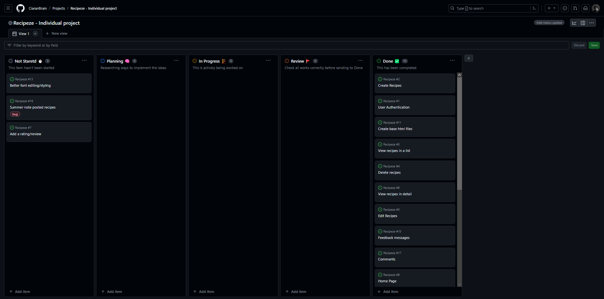

### **User stories** 

| I want to | So i can | Acceptance Criteria | Achieved | Next Iteration | 
| -------- | -------- | -------- | -------- | -------- |
| Create an account  | Edit my profile, create recipes, and comment/review recipes  | Users should be able to create an account with a username, password, and potentially an email address.| :white_check_mark: | -------- |
|--------|--------|Logged-in users should have access to features like saving recipes, creating recipes, and potentially rating/commenting on recipes  | :white_check_mark: | Add saved recipes section |
| Create/add new recipes   | Share them with everyone else   | I can create new recipes by adding a title, description, ingredients, instructions, image, and category.| :white_check_mark: | Enhance recipe categorization |
| Edit my posted recipes | ammend any issues/details | I can edit my existing recipes | :white_check_mark: | -------- |
| Delete my posted recipes | so they are removed | I can delete my own recipes. | :white_check_mark: | -------- |
| View all the recipes | so i can see which one i like the most | The website should have a section or page displaying a list of the all added recipes. | :white_check_mark: | Implement search and filter functionality |
| -------- | -------- | This list should update automatically as new recipes are created. | :white_check_mark: | -------- |
| View a detailed view | see all the information in the recipe | Clicking on a recipe in list should display a detailed page for that recipe. | :white_check_mark: | Implement related recipes section |
| -------- | -------- | The recipe details page should display the recipe's title, description, ingredients, instructions, image (if uploaded), and category. | :white_check_mark: | -------- |
| leave a review | people can see if it is good or not | Logged-in users should be able to rate recipes using a star rating system or similar method. | -------- | :white_check_mark: |
| -------- | -------- | Users should be able to write a review for a recipe along with their rating (optional). | -------- | :white_check_mark: |
| -------- | -------- | The average rating and potentially some user reviews should be displayed on the recipe detail page. | -------- | :white_check_mark: |
| dispaly messages | see feedback updates | I want to display a message when posted a new recipe | :white_check_mark: | Improve messaging interface |
| -------- | -------- | i want to display a warning message if you are about to delete a recipe | -------- | :white_check_mark: |

### **Models**

This was my original planned model 

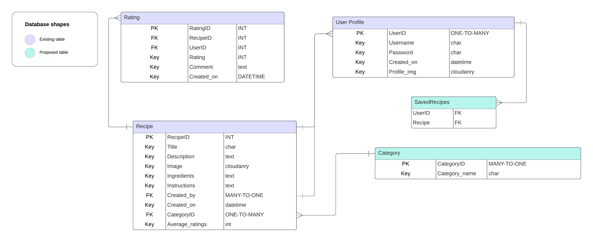

## **Wireframes**
Explore the visual representation of Recipeze's layout and user interface. These blueprints provide insights into the application's design, ensuring a user-friendly experience and will be fully responsive and accessible on mobile, tablet and desktop devices.

| Home | About |
|---|---|
| 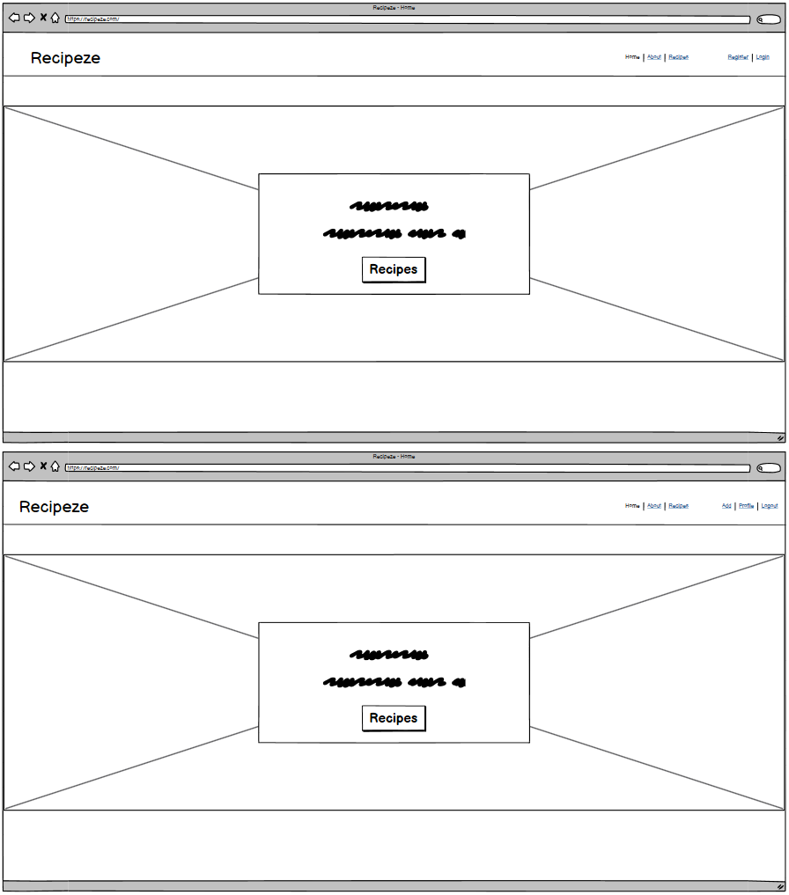 View of the home wireframe with logged in/ logged out view | 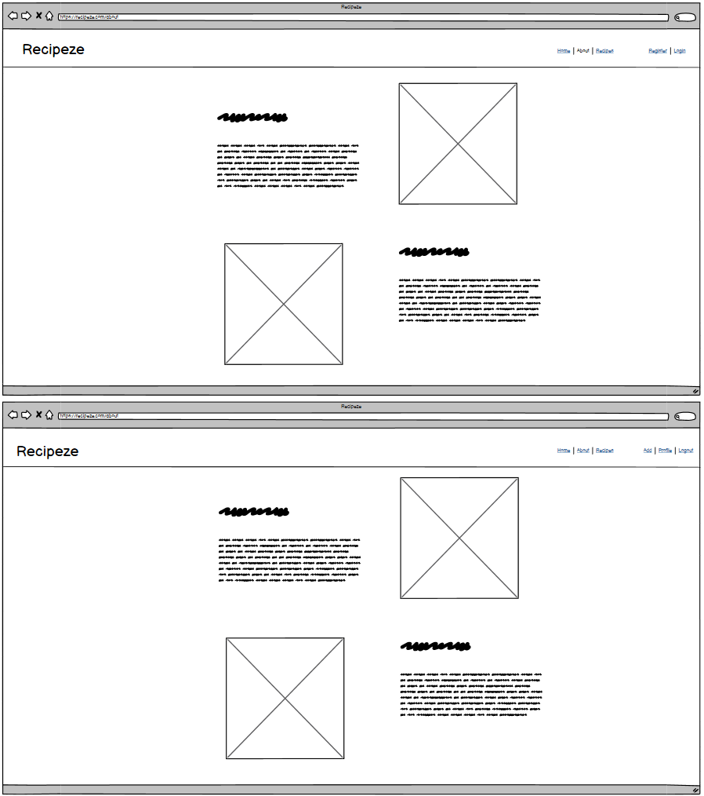 View of the home wireframe with logged in/ logged out view |

| Recipes List | Recipes Detail |
|---|---|
| 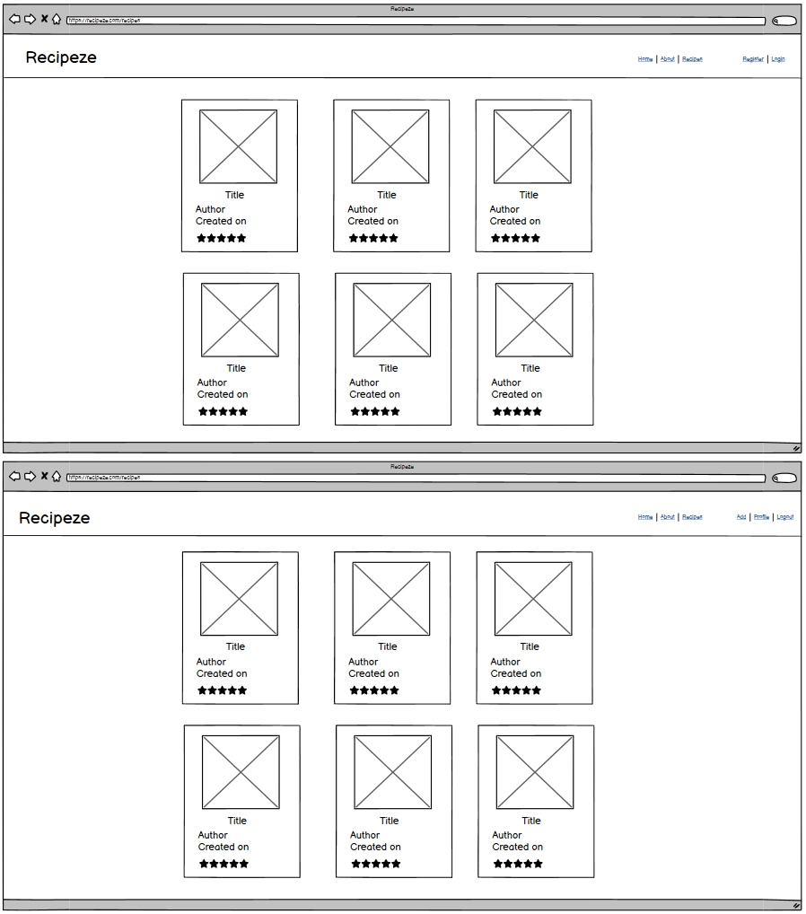 View of the recipe list with logged in/ logged out view  | 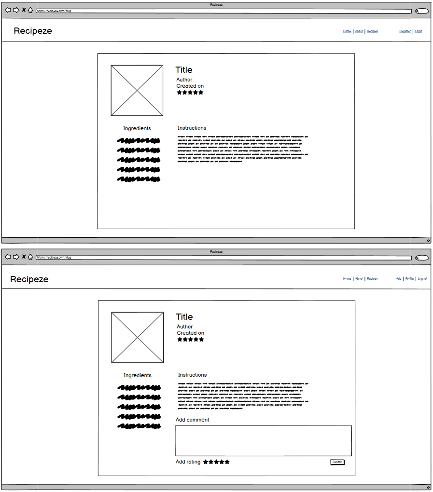 View of the recipe detail with logged in/ logged out view |

| Add Recipe | Profile |
|---|---|
| 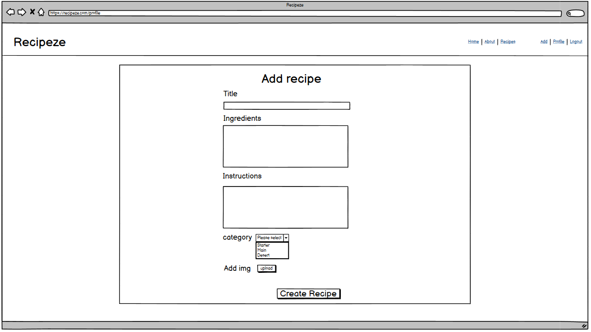 View of the add recipe page  | 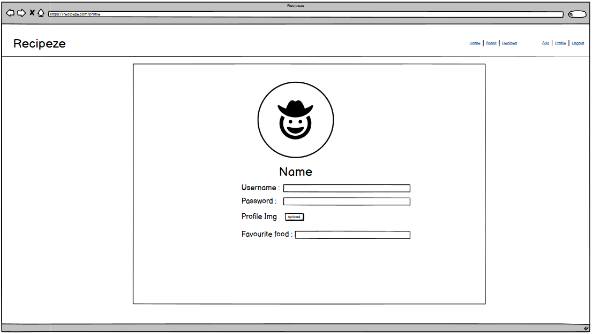 View of profile page|

| Register | Sign in |
|---|---|
| 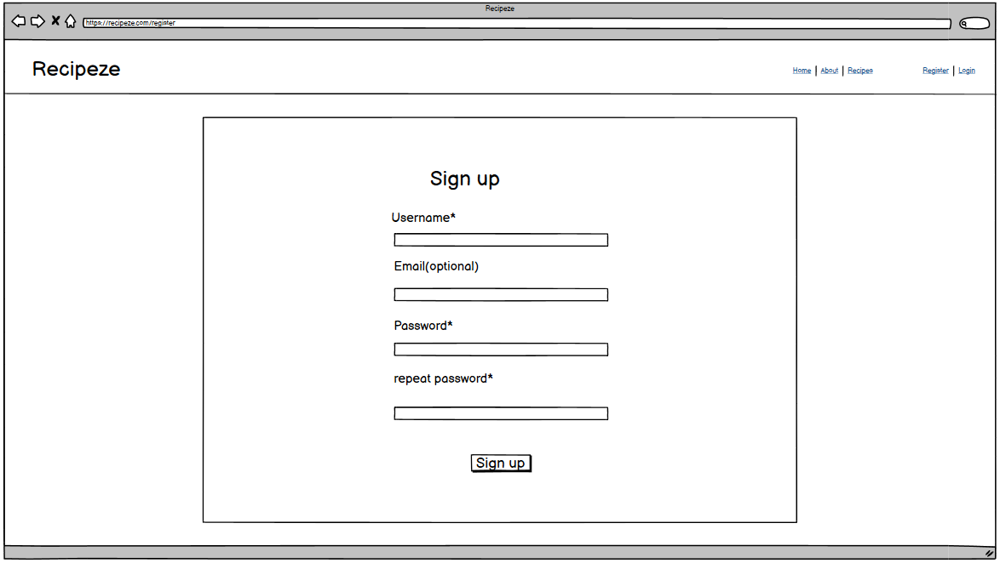 View of the register page  | 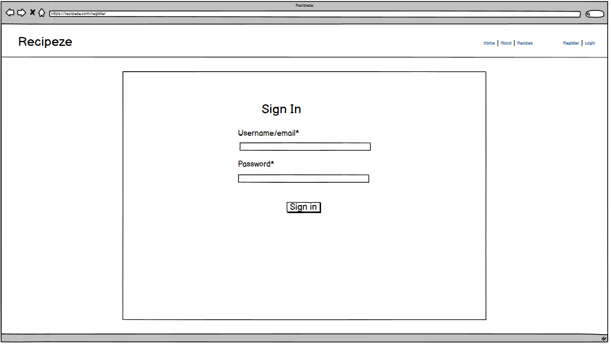 View of the sign in page|

## **Testing**
Recipeze is fortified with unit tests to guarantee the reliability and functionality of its core features. 

go over all of your project’s features and ensure that they all work as intended, with the project providing an easy and straightforward way for the users to achieve their goals.

how your project looks and works on different browsers and screen sizes.

bugs or problems you discovered during your testing, even if you haven't addressed them yet.

### Manual Testing 

Admin Testing
| Test | Result |
| --- | --- |
| Admin can add a recipe from admin panel | Pass |
| Admin can edit/delete recipes | Pass |
|Admin can use summernote features(bullet points, bold, underlined) | Pass|

Non logged in user tests
| Test | Result |
| --- | --- |
| user can only see "home, about, recipes, regiser and log in" | pass |
| user can't add recipe when manualy adding "/add_recipe" | Pass |

Account sign up tests 
| Test | Result |
| --- | --- |
| User can create profile |	Pass |
| User can log into profile | Pass |
| User can log out of profile |	Pass |
| Messages are displaying |	Pass |
| shows if you are signed in or out | Pass |

Navigation Tests 
| Test | Result |
| --- | --- |
| User can nagivate to home by "Home" in navbar or navbrand | Pass |
| User can nagivate to about by "About" in navbar | Pass |
| User can nagivate to recipes by "Recipes" in navbar or homepage when logged in | Pass |
| User can nagivate to profile by "Profile" in navbar when logged in | Fail |
| User can nagivate to register by "Register" in navbar or homepage when not logged in | Pass |
| User can nagivate to login by "Login" in navbar | Pass |

Authorisation Tests 
| Test | Result |
| --- | --- |
| Only logged in users can add recipe | Pass |
| Only logged in users which posted recipe can edit/delete | Pass |
| Only logged in users can comment | Pass |
| Only logged in users which posted the comment can edit/delete | Pass |

### **Validator Testing** 

- **HTML, CSS, PYTHON Tests**
  - [VALIDATION TESTS](VALIDATION.md)

### **Unfixed Bugs**

unfixed bugs and why they were not fixed. 

- print button, printing out the page and not just the form.
- cloudinary upload from form stopped working.

## **Deployment**

Here's a deployment section for your README tailored for a Django project using ElephantSQL and Cloudinary:

## Deployment

This Django project is designed for deployment on a platform that supports Python web applications. Here's a guideline for deployment:

**1. Project Setup:**

- Install required dependencies for deployment:
    - `env.py`
    - `Procfile`
    - `gunicorn`
    - `whitenoise`
- Update `settings.py` with:
    - ElephantSQL database configuration using `dj_database_url`.
    - Cloudinary configuration for media storage (refer to Cloudinary's Django documentation).
    - Set `DEBUG` to `False` for production.
- Initialize a Git repository and configure version control.
- Create a `Procfile` specifying the web server command (e.g., `web: gunicorn myproject.wsgi`).

**2. Platform-Specific Deployment:**
  - **Heroku:**
      - Set the Python buildpack for your app in Heroku's settings.
      - Install the `dj-database-url` and `cloudinary-storage` packages in Django.
      - Install projects requirements 
        - pip install -r requirements.txt
      -  or if they are already installed on your environment 
        - pip freeze --local > requirements.txt 
      - Set environment variables in Heroku Config Vars

      | Key | Value |
      |----|----|
      | CLOUDINARY_URL | use user's own value |
      | DATABASE_URL | use user's own value |
      | DISABLE_COLLECTSTATIC | 1 (this is temporary, and can be removed for the final deployment) |
      | SECRET_KEY | use user's own value |

**3. Additional Notes:**

- Consider using a separate worker process for background tasks (e.g., Celery) if your project requires them. 
- You might need to configure settings related to static files serving depending on the platform.
- Refer to the platform's documentation for details on environment variables, configuration management, and scaling.

## **Credits**

This project incorporates content and media from various sources. Here's a detailed breakdown:

**Content:**

- **Recipes:** This project uses recipes generated by ChatGPT: [https://openai.com/blog/chatgpt/](https://openai.com/blog/chatgpt/).
  -While ChatGPT assisted with recipe generation, the content was reviewed and curated for accuracy and quality.  

**Media:**

- **Logo:** Logo sourced from: [https://logo.com](https://logo.com) 
- **Recipe Images:** Sourced from Freepik: [https://www.freepik.com](https://www.freepik.com)
- **Fonts** Used from googlefonts: [GoogleFonts](https://fonts.google.com)

**Tutorials and Reference:**

Thanks to the following YouTube channels for providing helpful tutorials:
  - Tech With Tim ([YouTube Channel](https://www.youtube.com/@TechWithTim))
  - Iona Frisbee ([YouTube Channel](https://www.youtube.com/@IonaFrisbee))
  - Net Ninja ([YouTube Channel](https://www.youtube.com/@NetNinja))
  - dominicvacchiano ([YouTube Channel](https://www.youtube.com/@dominicvacchiano))

 **Code:** 
  - Some inspiration was used from the Code Institue blog, the content was reviewed and modified to suit my needs ([https://github.com/Code-Institute-Org](https://github.com/Code-Institute-Org))
  - Blog inspiration was helped from rachbry ([github profile](https://github.com/rachbry/recipme-django-cookbook))

**General Guidance:** 
- [W3 Schools](https://www.w3schools.com/django/index.php) for providing a comprehensive Django reference.
- [Chat GPT](https://openai.com/blog/chatgpt/) for general help/problem solving 
- Special thanks to  [Steve](https://github.com/stevewhitehouse66),  [Tariq](https://github.com/Tariq-845), [Manjula](https://github.com/mlal83), [Joel](https://github.com/joelezra) for help and support when working on my project.
