# Validation Testing

## HTML and CSS

I used the W3c validator on my HTML and CSS files.  Please see results below:

### HTML

| File | URL | Screenshot | Notes |
|--------|--------|--------|--------|
| Home (not logged in) | [w3 validator test - Homepage -  not logged in ](https://validator.w3.org/nu/?doc=https%3A%2F%2Frecipeze-da8be575c94f.herokuapp.com "Home Page Not Logged In") | 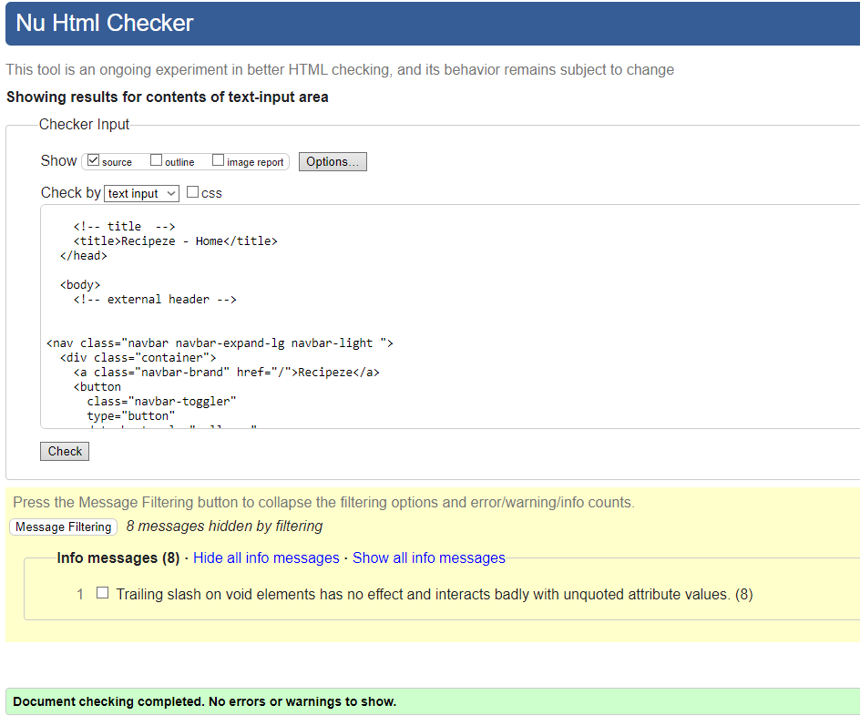 | Document checking completed. No Errors or Warnings to show |
| Home (logged in) | [w3 validator test - Homepage - logged in ](https://validator.w3.org/nu/?doc=https%3A%2F%2Frecipeze-da8be575c94f.herokuapp.com "Home Page Logged In")  |  | Document checking completed. No Errors or Warnings to show |
| About | [w3 validator test - About Page ](https://validator.w3.org/nu/?doc=https%3A%2F%2Frecipeze-da8be575c94f.herokuapp.com%2Fabout "About Page") | 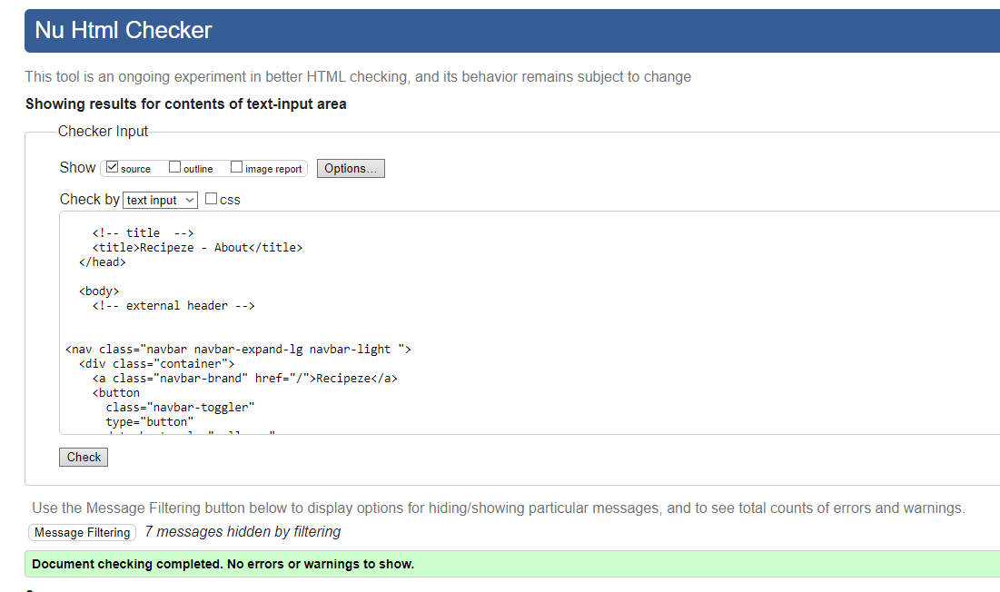 | Document checking completed. No Errors or Warnings to show |
| Add Recipe | [w3 validator test - Add Recipe  Page ](https://validator.w3.org/nu/?doc=https%3A%2F%2Frecipeze-da8be575c94f.herokuapp.com%2Frecipes%2Fadd_recipe%2F#textarea "Add Recipe Page") | 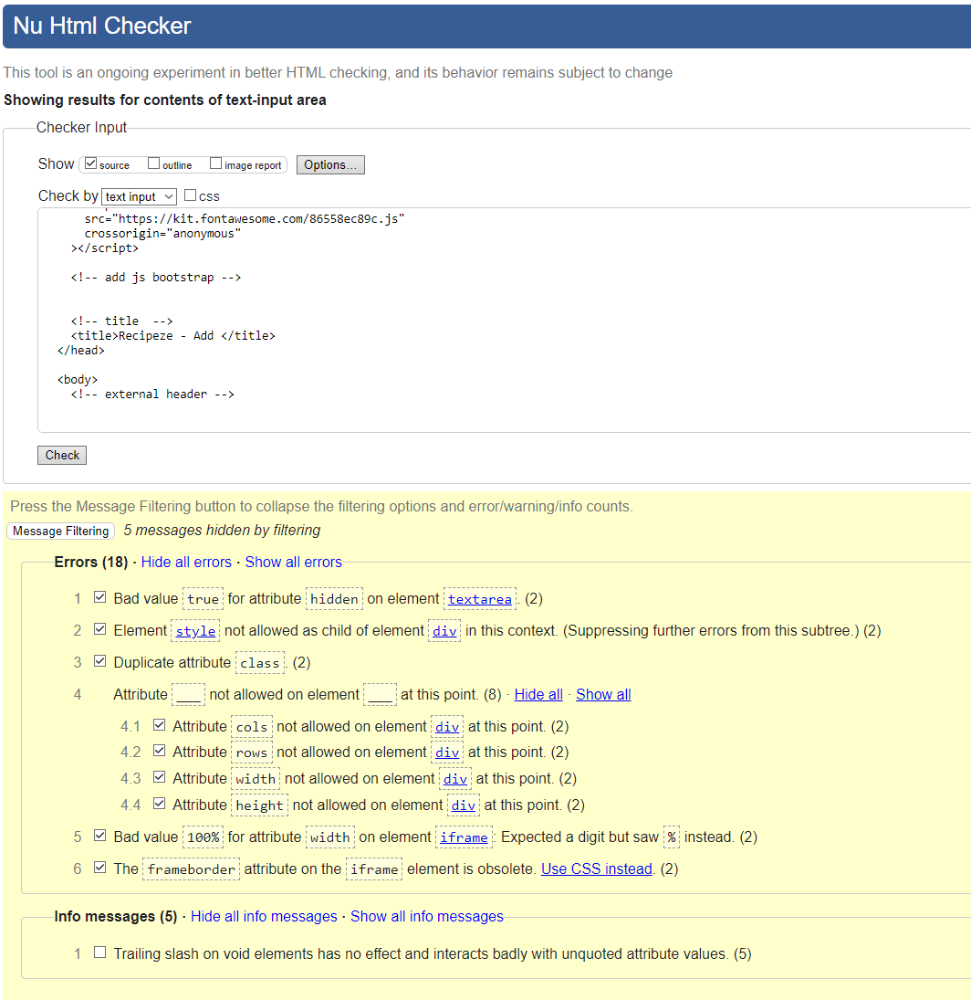 | Errors in add recipe page due to using summernote, looking for a fix |
| Edit Recipe | [w3 validator test - Edit Recipe Page ](https://validator.w3.org/nu/?doc=https%3A%2F%2Frecipeze-da8be575c94f.herokuapp.com%2Fabout "Edit Recipe Page")https://validator.w3.org/nu/#textarea| 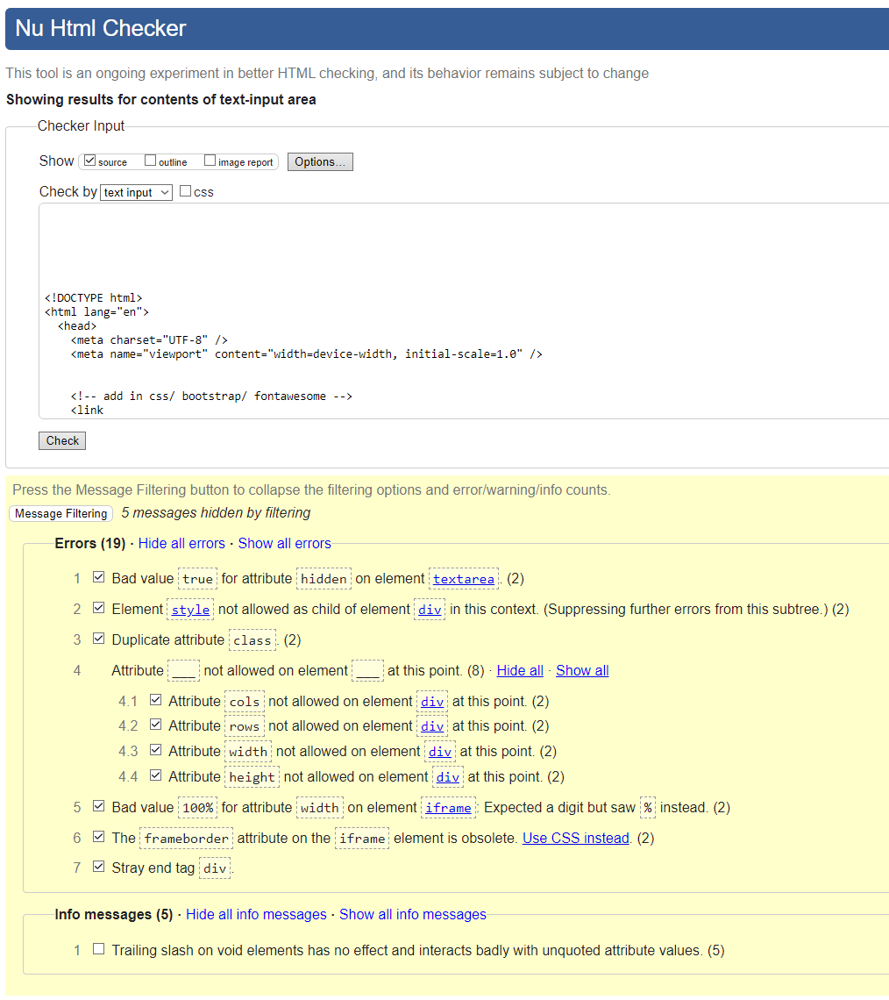 | Errors in edit recipe page due to using summernote, looking for a fix |
| Register | [w3 validator test - Register Page ](https://validator.w3.org/nu/?showsource=yes&doc=https%3A%2F%2Frecipeze-da8be575c94f.herokuapp.com%2Faccounts%2Fsignup%2F "Register Page") | 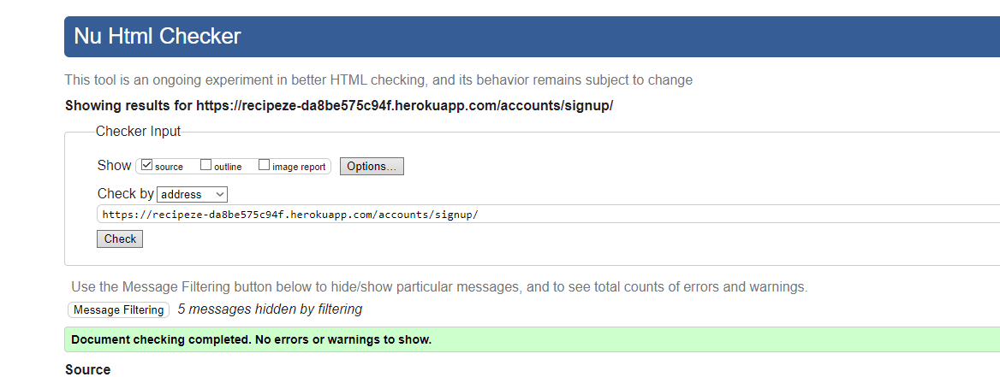 | Document checking completed. No Errors or Warnings to show |
| Sign In | [w3 validator test - Sign In Page ](https://validator.w3.org/nu/?showsource=yes&doc=https%3A%2F%2Frecipeze-da8be575c94f.herokuapp.com%2Faccounts%2Flogin%2F "Sign in Page") | 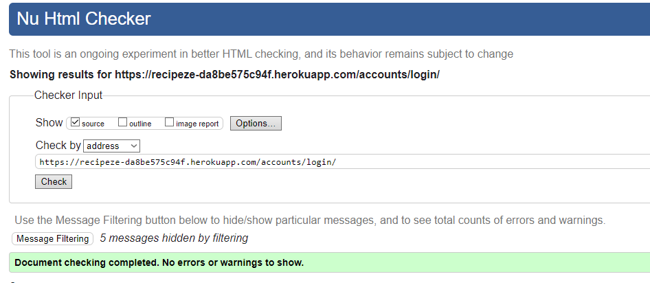 | Document checking completed. No Errors or Warnings to show |
| sign Out | [w3 validator test - Sign Out Page ](https://validator.w3.org/nu/?showsource=yes&doc=https%3A%2F%2Frecipeze-da8be575c94f.herokuapp.com%2Faccounts%2Flogout%2F "Sign out Page") | 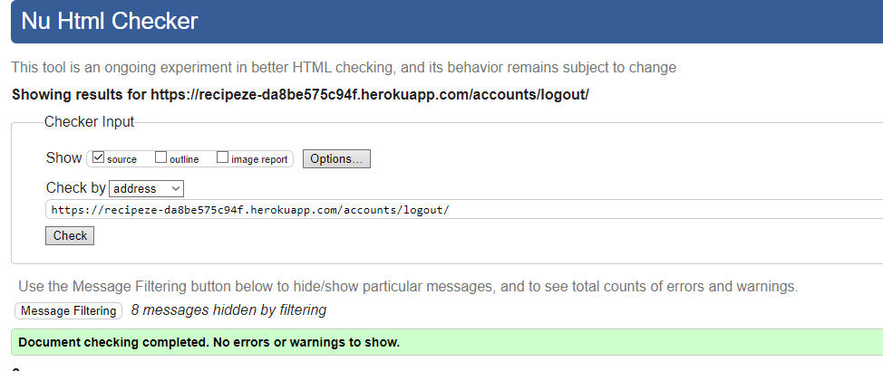 | Document checking completed. No Errors or Warnings to show |   

### CSS

| File |  URL | Screenshot | Notes |
|--------|--------|--------|--------|
| style.css | https://jigsaw.w3.org/css-validator/validator#css | 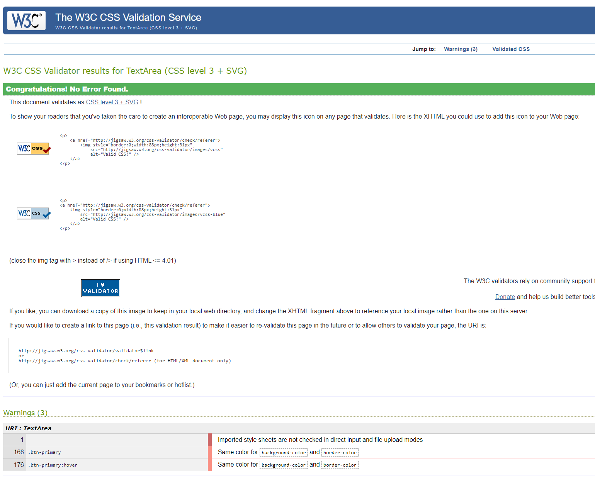 | No Error Found - could not acquire a working link |

### PYTHON

I used the CI Python Linter https://pep8ci.herokuapp.com/# on all my .py files. Please see results below.
| File | Screenshot | Notes |
|--------|--------|--------|
| config urls.py | 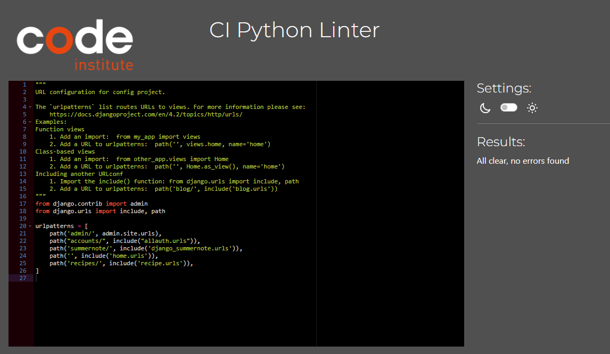 |  |
| config setting.py | 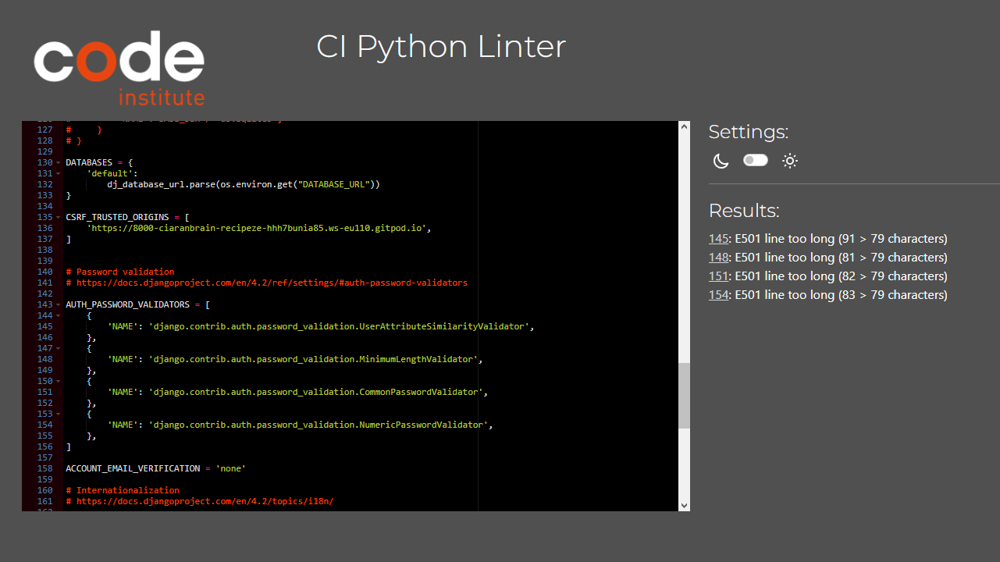 | default Django code |
| admin.py | 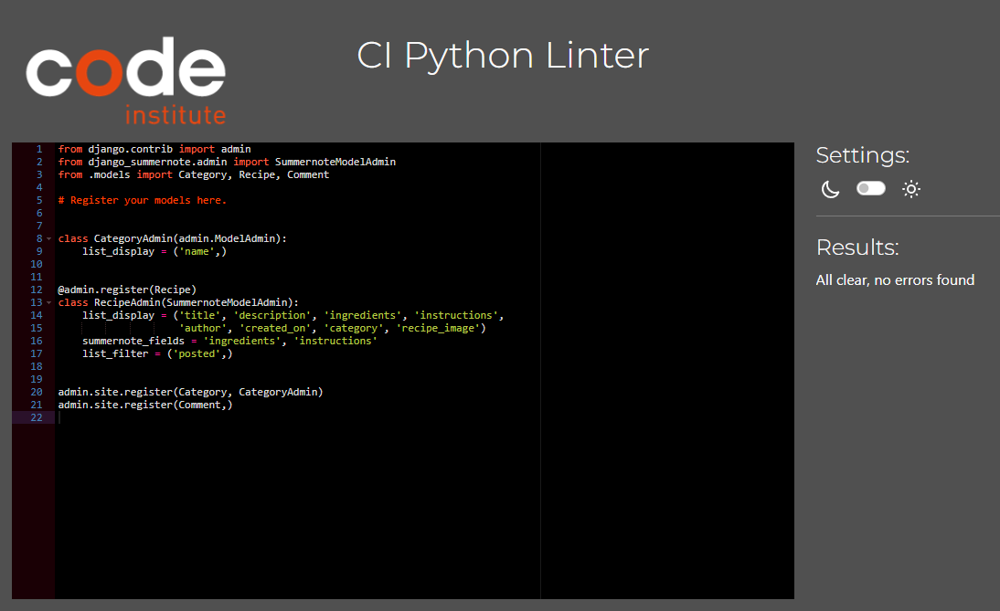 | 
| forms.py | 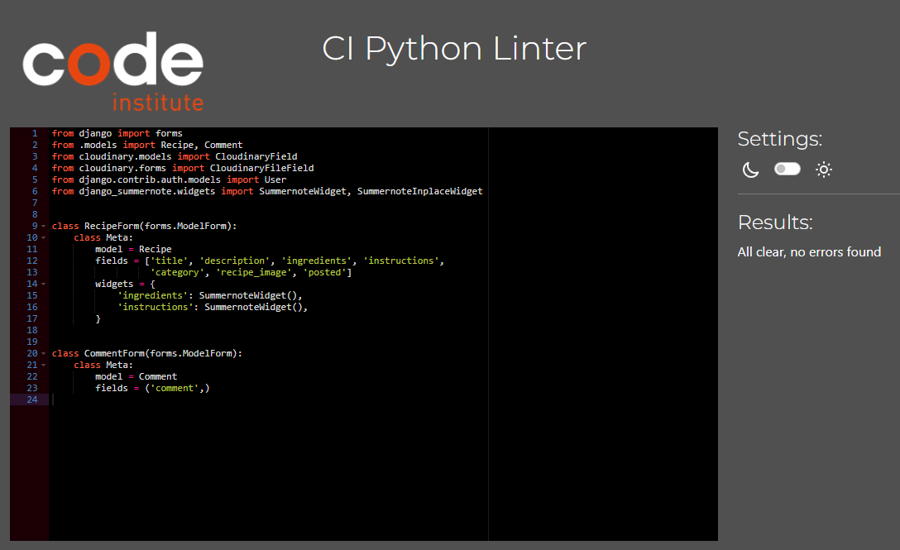 ||
| models.py | 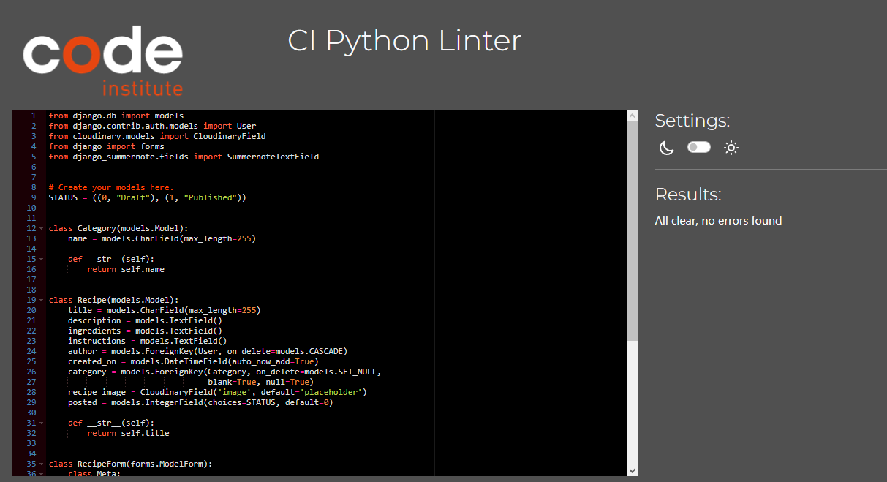 | |
| recipe urls.py | 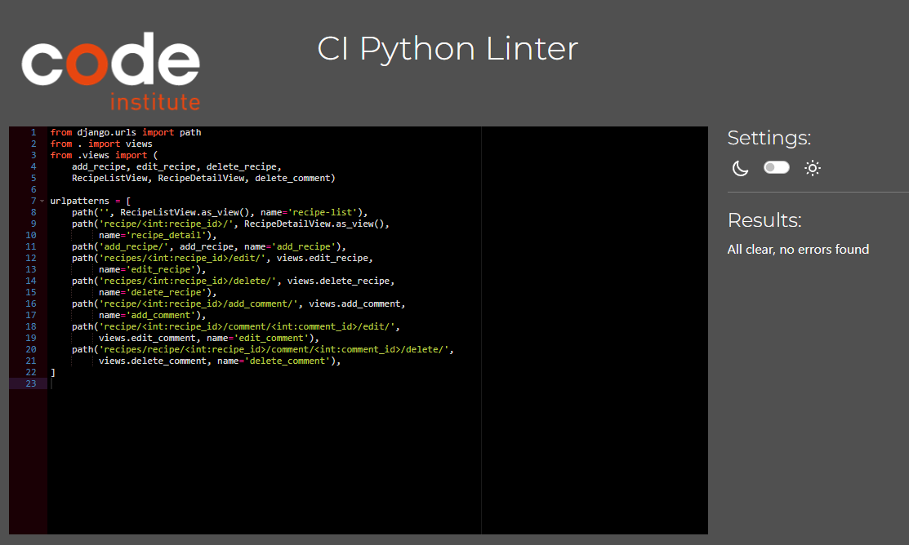 | |
| views.py | 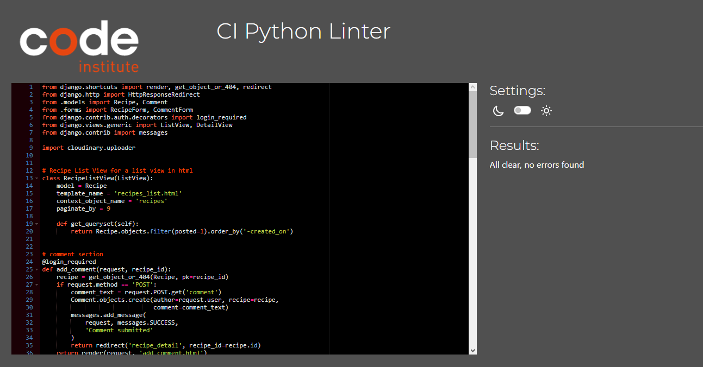 | |

